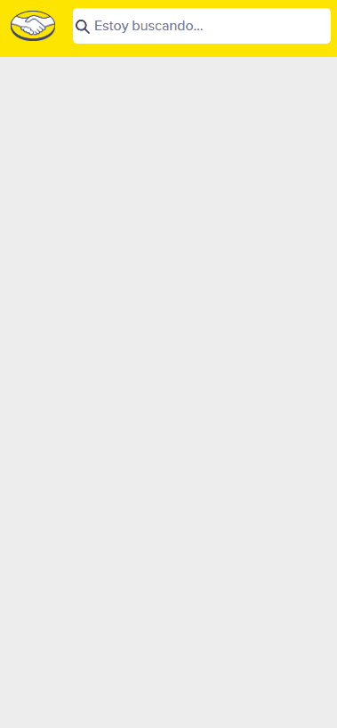

# Challenge MELI 🚀

Challenge de MercadoLibre que consiste en la creación de un servidor con Node.js y un front-end con React.

## Vista final 🖥️📱
**Desktop:**


**Mobile:**



## Requisitos previos 🛠️

- [Node.js](https://nodejs.org/) (versión recomendada: 14 o superior)

## Instalación ⚙️

Para configurar el proyecto, sigue los siguientes pasos:

1. **Clona este repositorio**:
    ```bash
    git clone https://github.com/AgustinPolicano/challenge-meli.git
    cd challenge-meli
    ```

2. **Configura el servidor**:
    ```bash
    cd .\server-meli\
    npm install
    ```

3. **Ejecuta el servidor**:
    ```bash
    npx ts-node app/app.ts
    ```

4. **(Opcional) Configura el front-end**:
    Navega a la carpeta del proyecto de React y ejecuta:
    ```bash
    cd .\meli-front\
    npm install
    npm start
    ```

## Uso 🚀

Una vez que el servidor esté en funcionamiento, puedes interactuar con la API a través de los endpoints definidos. El front-end proporciona una interfaz de usuario para realizar búsquedas en la plataforma de MercadoLibre y ver los detalles de los productos.

## Tecnologías utilizadas 🧩

- **React**: Biblioteca para la construcción del front-end.
- **TypeScript**: Superset de JavaScript que añade tipado estático.
- **Node.js**: Entorno de ejecución para JavaScript en el servidor.
- **Chakra UI**: Librería de componentes de interfaz de usuario para el diseño del front-end.
- **Jest**: Framework de pruebas unitarias para JavaScript.

## Pruebas 🧪

Para ejecutar las pruebas unitarias, usa el siguiente comando en la raíz del proyecto:
```bash
cd .\meli-front\
npm test
